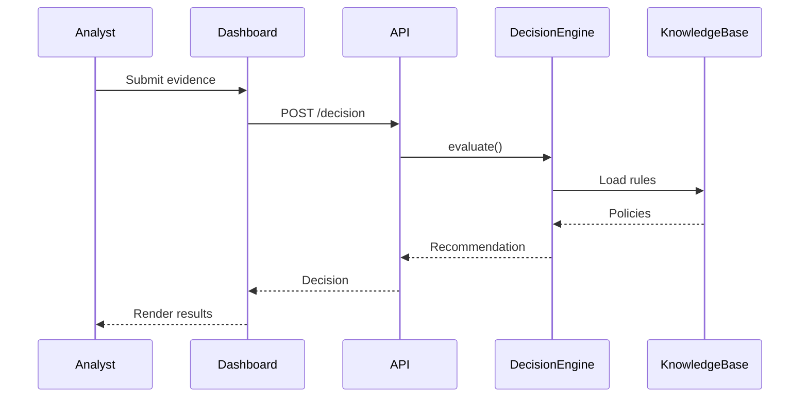

# Evaluation Flow

```mermaid
sequenceDiagram

participant Analyst

participant Dashboard

participant API

participant DecisionEngine

participant KnowledgeBase

Analyst->>Dashboard: Submit evidence

Dashboard->>API: POST /decision

API->>DecisionEngine: evaluate()

DecisionEngine->>KnowledgeBase: Load rules

KnowledgeBase-->>DecisionEngine: Policies

DecisionEngine-->>API: Recommendation

API-->>Dashboard: Decision

Dashboard-->>Analyst: Render results
```
