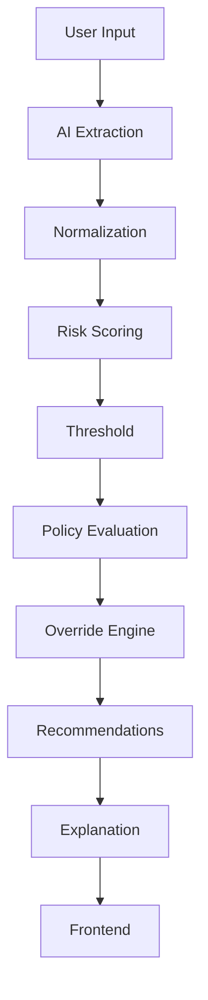

# Decision Flow

```mermaid
flowchart TD

A[User Input]

B[AI Extraction]

C[Normalization]

D[Risk Scoring]

E[Threshold]

F[Policy Evaluation]

G[Override Engine]

H[Recommendations]

I[Explanation]

J[Frontend]

A-->B

B-->C

C-->D

D-->E

E-->F

F-->G

G-->H

H-->I

I-->J
```
